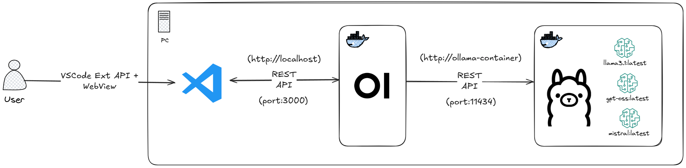
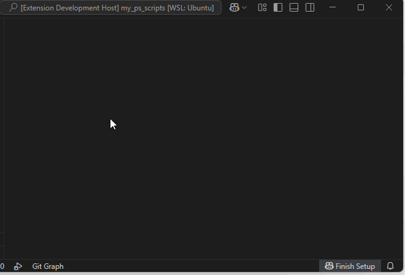
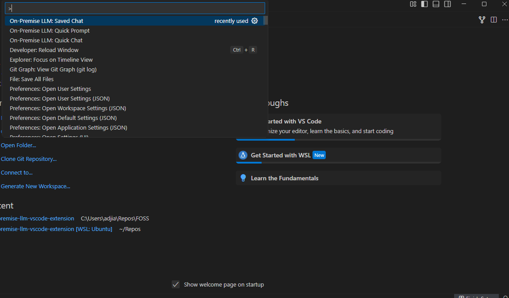
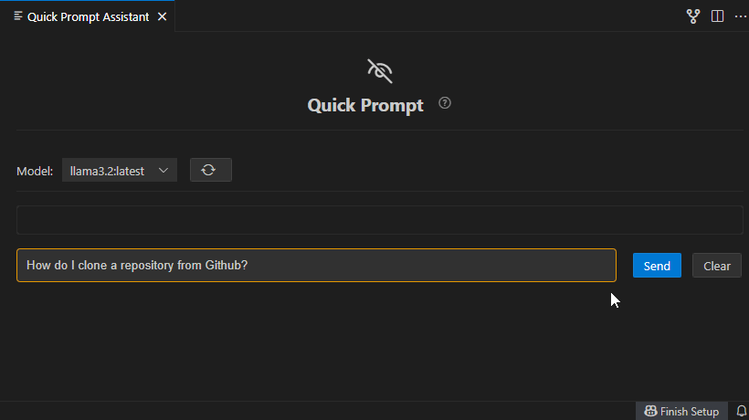
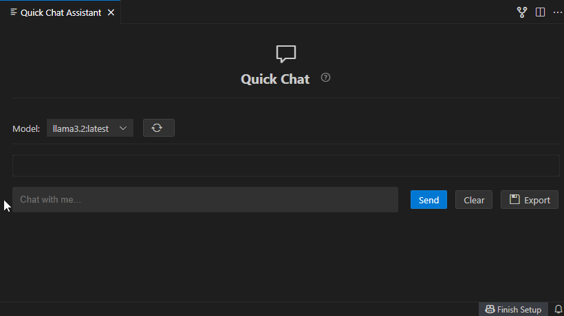
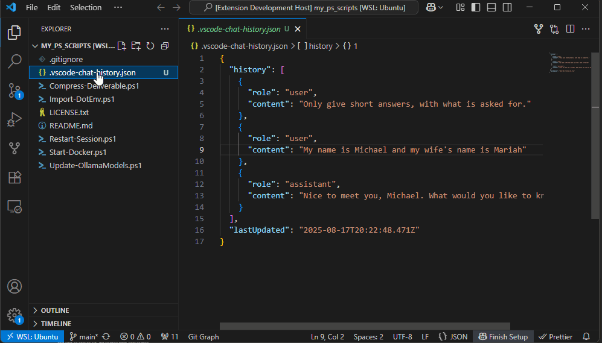
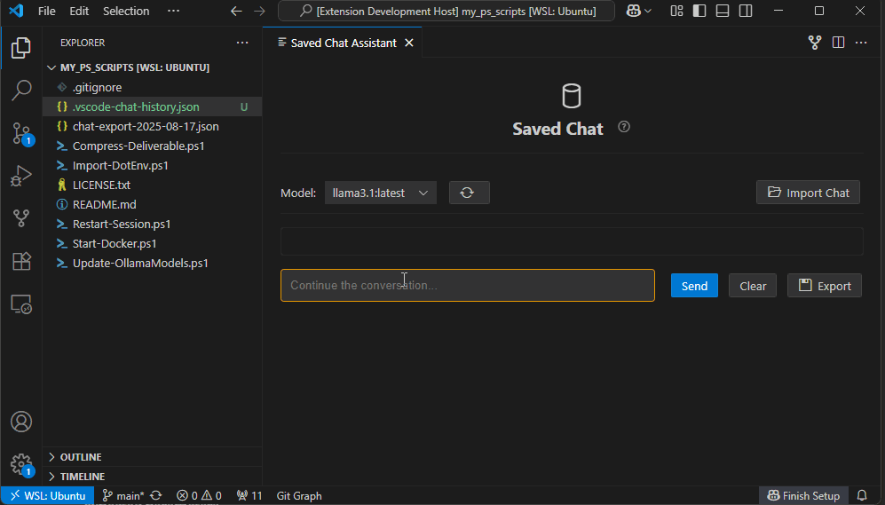

# On-Premise LLM OpenWebUI Assistant

> [!NOTE]
> A VSCode extension for seamless integration with local/on-premise LLM services via Ollama and OpenWebUI APIs

<!-- TABLE OF CONTENTS -->
## Table of Contents

<ol>
  <li>
    <a href="#about-the-project">About The Project</a>
    <ul>
      <li><a href="#key-features">Key Features</a></li>
      <li><a href="#chat-modes-features">Chat Modes Features</a></li>
    </ul>
  </li>
  <li>
    <a href="#getting-started">Getting Started</a>
    <ul>
      <li><a href="#prerequisites">Prerequisites</a></li>
      <li><a href="#installation">Installation</a></li>
      <li><a href="#configuration">Configuration</a></li>
    </ul>
  </li>
  <li>
    <a href="#usage">Usage</a>
    <ul>
      <li><a href="#quick-start">Quick Start</a></li>
      <li><a href="#chat-modes-usage">Chat Modes Usage</a></li>
      <li><a href="#importexport">Import/Export</a></li>
    </ul>
  </li>
  <li>
    <a href="#developer-setup">Developer Setup</a>
    <ul>
      <li><a href="#development-environment">Development Environment</a></li>
      <li><a href="#developer-workflow">Developer Workflow</a></li>
      <li><a href="#packaging--distribution">Packaging & Distribution</a></li>
    </ul>
  </li>
  <li><a href="#troubleshooting">Troubleshooting</a></li>
  <li><a href="#roadmap">Roadmap</a></li>
  <li><a href="#linked-projects">Linked Projects</a></li>
</ol>

<!-- ABOUT THE PROJECT -->
## About The Project


The On-Premise LLM OpenWebUI Assistant is a VSCode extension that provides seamless integration with local Large Language Model (LLM) services. 
It is built for programming enthusiasts/professionals that require AI assistance while maintaining complete control over their data and infrastructure,
by implementing local LLM via Ollama+OpenWebUI solution

> [!NOTE]
> I am aware of GitHub Copilot, Windsurf, Cursor, or Claude Code. But none of them were able to satisfy my curiosity
> nor my needs for the local LLM that can talk with my local workspace, and also utilizing my own AI infrastructure

### Key Features

- ✅ **Three distinct chat modes** for different use cases
- ✅ **Workspace integration** with visible conversation files
- ✅ **Model selection** with dynamic loading from OpenWebUI
- ✅ **Import/Export functionality** for conversation backup and sharing
- ✅ **System prompt support** for customized AI behavior
- ✅ **Enterprise-ready security** with API key authentication
- ✅ **Zero external dependencies** - works entirely with your on-premise infrastructure

### Chat Modes Features

> [!NOTE]
> See the screenshots below in (usage)[#usage] for comparison of each modes

#### 🔒 Quick Prompt (Incognito Mode)
- **Truly stateless** - no conversation memory
- **Perfect for** sensitive queries or one-off questions
- **Use case**: Quick code explanations, syntax checking

#### 💬 Quick Chat (Session Memory)
- **Session-only memory** - persists during VSCode session
- **Clears on restart** - no permanent storage
- **Use case**: Temporary brainstorming, debugging sessions

#### 💾 Saved Chat (Persistent Memory)
- **Workspace persistence** - survives VSCode restarts
- **Visible JSON files** in your workspace
- **Import/Export support** for sharing and backup
- **Use case**: Long-term project discussions, documentation

## Getting Started

### Prerequisites



**Required Infrastructure:**
- Running [Ollama](https://ollama.com/) instance with models installed
- [OpenWebUI](https://github.com/open-webui/open-webui) providing REST API endpoints
- VSCode editor with extension support

**Minimum System Requirements:**
- VSCode 1.85.0 or higher
- Network access to your OpenWebUI instance
- Valid API key for OpenWebUI authentication

> [!TIP]
> **Don't have the infrastructure?** Check out our [Local LLM Infrastructure Setup](https://github.com/adjiap/on-premise-llm-infrastructure-setup) for complete deployment guides

**Test connectivity before installation:**

```bash
# Set environment variables (adjust URL and API key as needed)
export OPENWEBUI_URL_WITH_TAGS="http://localhost:3000/ollama/api/tags"
export OPENWEBUI_API_KEY="your_api_key_here"

# Test API connectivity
curl -H "Authorization: Bearer $OPENWEBUI_API_KEY" \
     $OPENWEBUI_URL_WITH_TAGS
```

### Installation

> [!NOTE]
> As of 15.08.2025, I am intentionally not putting this in the VSCode Marketplace, the same like my
> [Local Ollama PowerShell Wrapper API](https://github.com/adjiap/local-ollama-powershell-wrapper-api) and PowerShell Gallery
> maybe I'll change my mind later on, but for now, that's how it is.

#### Manual Installation (.vsix file)

##### Linux
```bash
# Download the latest release
## (Recommended) Using GitHub CLI
gh release download -R adjiap/on-premise-llm-vscode-extension -p "*.vsix"

## Using `wget`, change the version if needed
wget https://github.com/adjiap/on-premise-llm-vscode-extension/releases/download/v0.5.3/on-prem-llm-assistant-0.5.3.vsix

# Install using VSCode CLI
code --install-extension on-prem-llm-assistant.vsix
```

##### Windows
```powershell
# Download the latest release
## (Recommended) Using GitHub CLI
gh release download -R adjiap/on-premise-llm-vscode-extension -p "*.vsix"

## Using `Invoke-WebRequest`, change the version if needed
Invoke-WebRequest https://github.com/adjiap/on-premise-llm-vscode-extension/releases/download/v0.5.3/on-prem-llm-assistant-0.5.3.vsix

# Install using VSCode CLI
code --install-extension on-prem-llm-assistant-0.5.3.vsix
```


### Configuration



The extension will prompt you for configuration on first use:

1. **OpenWebUI Base URL** (e.g., `http://localhost:3000`)
2. **API Key** for authentication
3. **Default Model** name (e.g., `llama3.2:latest`)
4. **System Prompt** (optional)

**Manual Configuration:**
Access via VSCode Settings (`Ctrl+,`) → Extensions → On-Premise LLM Chat

## Usage

### Quick Start



1. **Open Command Palette** (`Ctrl+Shift+P`)
2. **Choose your mode:**
   - `On-Premise LLM: Quick Prompt` - For incognito queries
   - `On-Premise LLM: Quick Chat` - For session conversations  
   - `On-Premise LLM: Saved Chat` - For persistent discussions
3. **Start chatting** with your on-premise AI!

### Chat Modes Usage

#### Quick Prompt Usage


```
Perfect for:
✅ Code syntax questions
✅ Sensitive data queries  
✅ One-off explanations
❌ Multi-turn conversations
```

#### Quick Chat Usage


```
Perfect for:
✅ Debugging sessions
✅ Brainstorming ideas
✅ Temporary conversations
✅ Session-based context
```

#### Saved Chat Usage


```
Perfect for:
✅ Project documentation
✅ Long-term discussions
✅ Team collaboration
✅ Knowledge persistence
```

### Import/Export



**Export Conversations:**
- Click the Export button in Quick Chat or Saved Chat
- Choose location (defaults to workspace folder)
- Share JSON files with team members

**Import Conversations:**
- Click Import button in Saved Chat mode
- Select JSON file from previous exports
- Conversation history loads automatically

**Workspace Files:**
- Saved Chat creates `.vscode-chat-history.json` in your workspace
- Files are visible and can be version controlled
- Perfect for team collaboration and project continuity

## Developer Setup

> [!NOTE]
> This section is for developers who want to contribute to the extension or build from source

### Development Environment

> [!NOTE]
> The prerequisites aren't really a minimum, it's just something that I used to develop the extension.

**Prerequisites:**
- Windows 11 with WSL2 installed
- Ubuntu 24.04 LTS running in WSL
- VSCode with WSL extension installed
- Node.js 22.x+ and npm 10.x+

#### Environment Setup

```bash
# Update package list
sudo apt update

# Install Node.js LTS via NodeSource repository
curl -fsSL https://deb.nodesource.com/setup_lts.x | sudo -E bash -
sudo apt install -y nodejs

# Install VSCode Extension generator tools
npm install -g yo generator-code @vscode/vsce

# Clone and setup project
git clone <repository-url>
cd on-prem-llm-assistant
npm install

# For enhanced WebView development
npm install @vscode/webview-ui-toolkit 

# Compile TypeScript
npm run compile

# Run in watch mode for development
npm run watch
```

### Developer Workflow

#### Daily Development

> [!TIP]
> **Always run autocompile during development:**
> ```bash
> npm run watch
> ```

**Development Cycle:**
1. **Code Changes** - Edit TypeScript/JavaScript files
2. **Auto-compile** - Watch mode compiles automatically  
3. **Test with F5** - Launch Extension Development Host
4. **Debug** - Use VSCode debugging tools
5. **Iterate** - Repeat cycle

#### Pre-Release Preparation

```bash
# 1. Stop autocompile (Ctrl+C)

# 2. Compile everything
npm run compile

# 3. Check TypeScript/Lint
npm run lint

# 4. Run tests
npm test
```

#### Version Management

```bash
npm version patch   # 0.1.0 -> 0.1.1 (bug fixes)
npm version minor   # 0.1.0 -> 0.2.0 (new features)
npm version major   # 0.1.0 -> 1.0.0 (breaking changes)
```

### Packaging & Distribution

#### Build Extension Package

```bash
# Compile everything first
npm run compile

# Package extension
npx vsce package
# Output: on-prem-llm-assistant-x.y.z.vsix
```

#### Install/Uninstall Locally

```bash
# Install locally
code --install-extension on-prem-llm-assistant-0.5.0.vsix

# Uninstall
code --uninstall-extension adjiap.on-prem-llm-assistant
```

## Troubleshooting

### Common Issues

#### Configuration Problems
```bash
# Test OpenWebUI connectivity
curl -H "Authorization: Bearer YOUR_API_KEY" \
     http://localhost:3000/ollama/api/tags

# Check VSCode settings
# File → Preferences → Settings → Extensions → On-Premise LLM Chat
```

#### Connection Issues
**Symptoms:** Extension shows "Failed to load models" or connection errors

**Solutions:**
1. **Verify infrastructure** - Ensure Ollama and OpenWebUI are running
2. **Check API key** - Confirm authentication credentials
3. **Test network** - Verify network connectivity to OpenWebUI
4. **Review settings** - Double-check URL and configuration

#### Model Loading Issues
**Symptoms:** No models appear in dropdown

**Solutions:**
1. **Install models** - Ensure models are pulled in Ollama (`ollama pull llama3.2:latest`)
2. **Check permissions** - Verify API key has model access
3. **Refresh manually** - Click the refresh button in model dropdown

#### Conversation Not Saving
**Symptoms:** Saved Chat conversations disappear

**Solutions:**
1. **Check workspace** - Ensure you have an open VSCode workspace
2. **Verify permissions** - Confirm write access to workspace directory
3. **Review file** - Check if `.vscode-chat-history.json` exists and is valid

### Debug Mode

Enable extension debugging:
1. Open Command Palette (`Ctrl+Shift+P`)
2. Run "Developer: Toggle Developer Tools"
3. Check Console tab for error messages

## Roadmap

### Current Version (v0.5.0)
- ✅ Three-mode chat system
- ✅ Workspace integration
- ✅ Import/Export functionality
- ✅ Functional programming refactor

### Upcoming Features

#### v0.6.0 - Pair Programming Mode
- [ ] **File system operations** - Read project files
- [ ] **Code understanding** - AST parsing and analysis

#### vX.X.X
- [ ] **Adding files to conversation** for knowledge building
- [ ] **Keyboard shortcuts** for faster access
- [ ] **Conversation search** functionality
- [ ] **Conversation templates** for common use cases
- [ ] **Advanced export formats** (Markdown, PDF)
- [ ] **Dark/Light theme** optimization
- [ ] **Performance optimizations** for large conversations

## Linked Projects

### My Infrastructure Setup
* [On-Premise LLM Infrastructure Setup](https://github.com/adjiap/on-premise-llm-infrastructure-setup) - Complete (business) deployment guides
* [Local Ollama PowerShell Setup](https://github.com/adjiap/local-ollama-powershell-setup) - Windows-specific single user

### My API Wrappers
* [Local Ollama PowerShell Wrapper API](https://github.com/adjiap/local-ollama-powershell-wrapper-api) - PowerShell integration

### Related Tools
* [Ollama](https://ollama.com/) - Local LLM runtime
* [OpenWebUI](https://github.com/open-webui/open-webui) - Web interface for Ollama

## License

This project is licensed under the MIT License - see the [LICENSE](LICENSE) file for details.

## Acknowledgements

* [Ollama](https://github.com/ollama/ollama) - For the excellent local LLM runtime
* [OpenWebUI](https://github.com/open-webui/open-webui) - For the comprehensive web interface
* [VSCode Extension API](https://code.visualstudio.com/api) - For the powerful extension framework
* [@vscode/webview-ui-toolkit](https://github.com/microsoft/vscode-webview-ui-toolkit) - For native VSCode UI components

---

**🚀 Ready to get started?** [Setup](https://github.com/adjiap/on-premise-llm-infrastructure-setup) your on-premise LLM infrastructure, 
[install the extension](#installation) and connect to your on-premise LLM infrastructure today!
